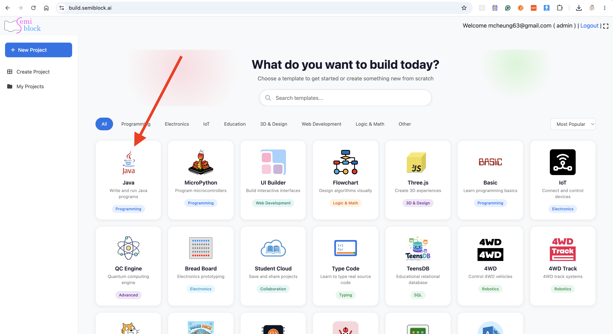
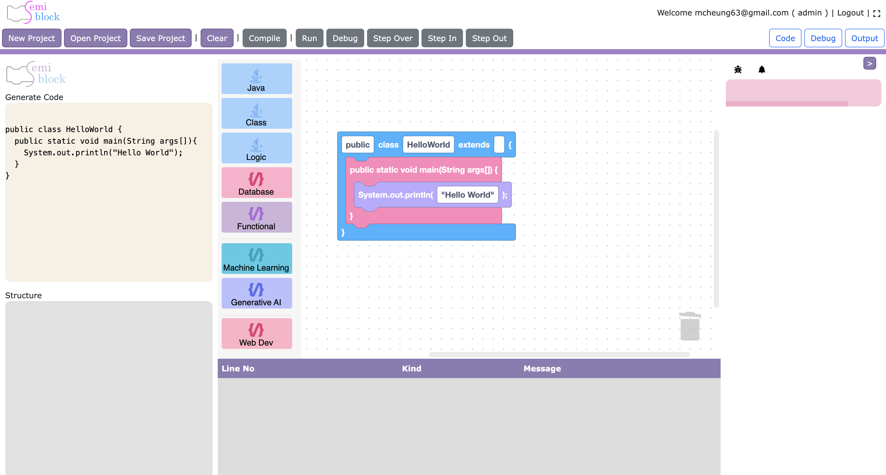

# Getting Started with SemiBlock Java

This page shows how to open the Java visual editor and build a small program using the available blocks.

## Launching the Editor

The Java editor is typically opened from within the SemiBlock / NewBlock platform (similar to the Three.js and Flowchart editors). It loads the bundled Blockly application from:

{width=100%}

After the bundle loads, a global `quantr` object is available with helper methods (`clearWorkspace`, `saveWS`, `load`, `getWS`, `getCode`).

## User Interface

The layout is a horizontal split:

- **Left / main area** (`#blocklyDiv`): The Blockly workspace with the `quantr` theme, grid, and toolbox on the left.
- **Right sidebar** (fixed 400 px, `#outputPane`):
  - Top half: Generated Java source (`#generatedCode`).
  - Bottom half: Inheritance diagram (`#output`) — a Graphviz SVG produced by ANTLR analysis of the generated code.

Toolbar buttons (provided by the host page) usually include **Clear**, **Save**, and **Load**.

## Toolbox Tour

Open the categories on the left. Representative blocks:

**Java**
- `newline`, `comment`, `identifier`
- `createAttribute` (visibility + static + type + name)
- `createFunction` (visibility + static + return type + name + body)
- `createMainMethod` (the classic `public static void main(String args[])` entry point)
- `sout` (`System.out.println(...)`)
- `forLoop` (C-style `for (int x = 0; x < 10; x++)`)
- `freeCode` (raw multiline Java via the multiline input field)
- `tryCatch`

**Class**
- `createClass` (`public class Name extends Super { ... }`)
- `createAttribute`, `createMethod` (for use inside classes)

**Logic**
- `if_statement`, `if_else_statement`
- `while_loop`, `do_while_loop`
- `switch_statement` + `case_statement`

**Database**
- `mysql_connect` (URL, user, password → `DriverManager.getConnection`)
- `mysql_execute_query`, `mysql_prepare_statement`
- `mysql_execute_update`, `mysql_fetch_results`
- `mysql_close_connection`, `mysql_handle_exception`

**Machine Learning** (experimental)
- `ml_load_model`, `ml_predict`, `ml_train_model`

Other categories (Functional, Generative AI, Web Dev) currently act as placeholders.

## Building Your First Program

1. Drag a `createClass` block into the workspace.
2. Set the class name (e.g. `HelloWorld`) and optionally a superclass.
3. Inside the class body, attach a `createMainMethod`.
4. Inside `main`, attach a `sout` block and type a string literal.
5. (Optional) Add a `createAttribute` at class level or a `createMethod`.

As soon as you place or edit blocks, the right-hand pane updates:
- The top shows the emitted Java source.
- If you used `extends`, the bottom shows a small inheritance graph (class → superclass) rendered by ANTLR + Graphviz.

Example generated output for a minimal program:

{width=100%}

## Tips

- Use `freeCode` when you need to paste or write complex Java that is not yet covered by dedicated blocks.
- The MySQL blocks emit simple JDBC snippets; you will still need the appropriate driver on the classpath in a real project.
- The ANTLR step only looks for top-level class declarations and `extends` relationships — it is a lightweight visualization aid, not a full compiler.
- Because the editor is a library, the host application is responsible for providing the final "Run" or "Compile" experience (the visual editor itself only produces source text and the diagram).

## Next Steps

- Explore the [Overview](overview.md) for architecture and integration details.
- Experiment by combining Class + Logic + Database blocks to model a small data-access class.
- When you are ready to embed or extend the editor, look at `src/index.js`, `toolbox.js`, `blocks/javaBlock.js`, and `generators/java.js` in the `blockly-java` source tree.

Happy block-based Java coding!